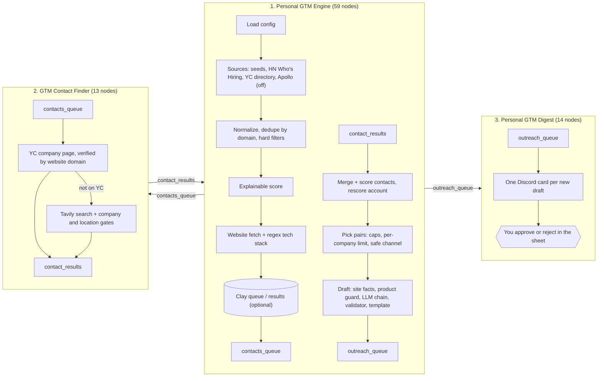
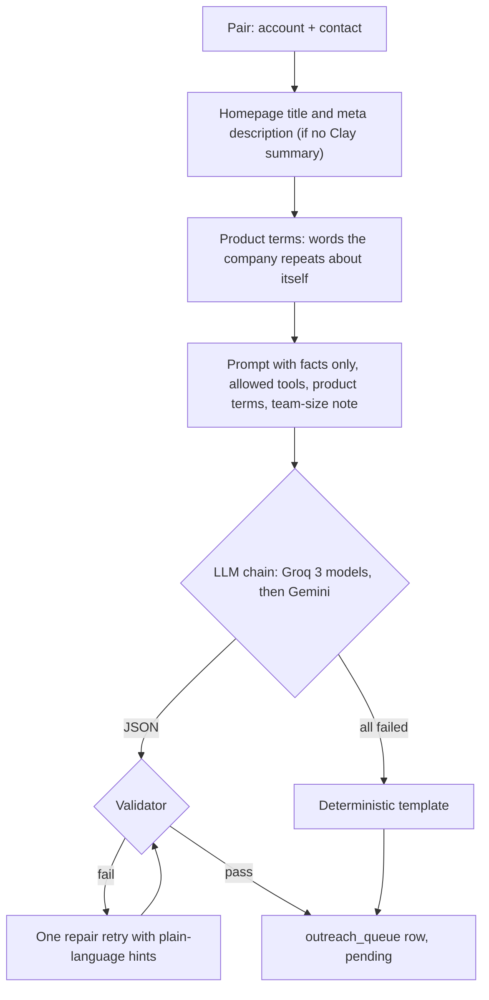

# Architecture

Three n8n workflows share one Google Sheet. Each workflow reads what the previous one wrote, so they run in order and every step can be inspected and corrected by hand in between.

## Run order

| Step | Workflow | Reads | Writes |
|---|---|---|---|
| 1 | Personal GTM Engine | config, seeds, sources | accounts, contacts_queue, ops |
| 2 | GTM Contact Finder | contacts_queue, accounts, contact_results | contact_results |
| 3 | Personal GTM Engine (again) | contact_results | contacts, outreach_queue, ops |
| 4 | Personal GTM Digest | outreach_queue, accounts, contacts | Discord, digest_ops |
| 5 | You | Discord | `approval_status` in outreach_queue |

Every stage is idempotent: ledgers (`seen_accounts`, `seen_contacts`, `outreach_queue`, `digest_log`) make a re-run write nothing new.

## Stage details

### Discovery and gates

| Source | How | Free tier use |
|---|---|---|
| `seed_accounts` tab | Read every run | None |
| Hacker News "Who is hiring" | Algolia API, two latest threads, strong-keyword gate | None (public API) |
| YC company directory | Public directory by tag, active companies with a website | None (public data) |
| Apollo company search | Code node, off by default (free plan returns nothing useful) | Credits only if enabled |

Hard filters run before any enrichment or LLM call: domain required, employee range, industry include/exclude, keyword include/exclude, UTC offset, company type, seen-before. Each rejection reason is counted in `ops.rejection_summary`.

### Enrichment

One GET per new account. Regex signatures detect CRM and tooling (HubSpot, Salesforce, Pipedrive, Stripe, Intercom and more) and hiring pages. Clay is an optional, human-bridged step: n8n queues high scorers, you run the Clay table, and the results are merged as evidence.

### Contact finder

1. For each queued account, guess the YC page slug and read the founders from the page's embedded JSON. Accepted only when the page lists the same website domain.
2. Accounts not on YC go to Tavily search restricted to LinkedIn profiles. Gates: the company name must be in the profile title or a current role, the location must not contradict the account's country. Name-only matches are kept as `tavily_unverified` and flagged on the draft.

### Drafting

Validator rules (deterministic): word counts per field, LinkedIn note length, follow-up lengths, company named in the first line, no links or placeholders, no money or percentages, no invented numbers, tool whitelist (only tools detected on the company's site), no first-person claims about the recipient, no partnership pitch, hedged statements only, no "which means" conclusions, no "ops team" at companies of 20 or fewer, and no product terms outside the observation. Every rejection reason lands in `risk_notes` so a reviewer sees why a draft needed a retry.

### Human in the loop

Nothing is sent by the system. The digest posts one card per draft (account, contact, why it matched, angle, pain, value proposition, LinkedIn note, long message, follow-ups, risk flags), each linking to its sheet row. You approve, edit or reject in the sheet and send by hand.

## Rate limits and pacing

| Provider | Handling |
|---|---|
| Groq | 6 s between drafts, 429 waits up to 20 s using `retry-after`, longer waits put that model on cooldown and the next model takes over |
| Gemini | Second provider in the chain, same handling |
| Tavily | 1 request per 1.2 s, YC lookup first so most accounts cost 0 credits |
| Discord | 1 message per 1.2 s, one message per draft to stay under the 6,000-character limit |
| Google Sheets | Every read node uses Execute Once; writes are batched |

See [ADR.md](ADR.md) for the reasoning behind each decision and [SHEET_SCHEMA.md](SHEET_SCHEMA.md) for every tab.
